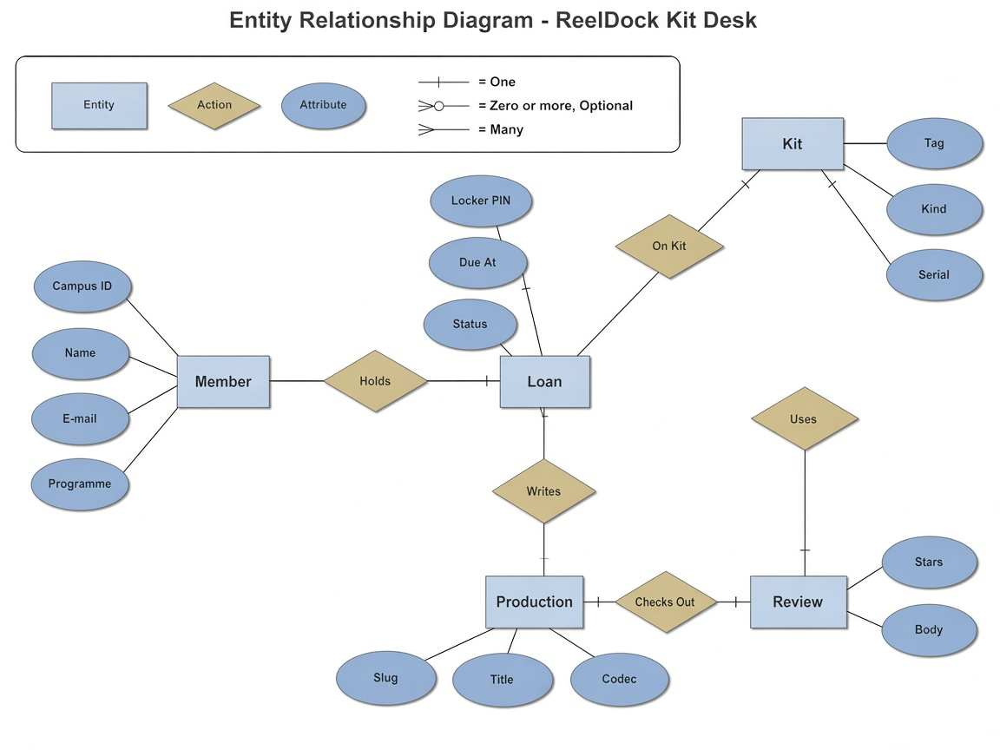
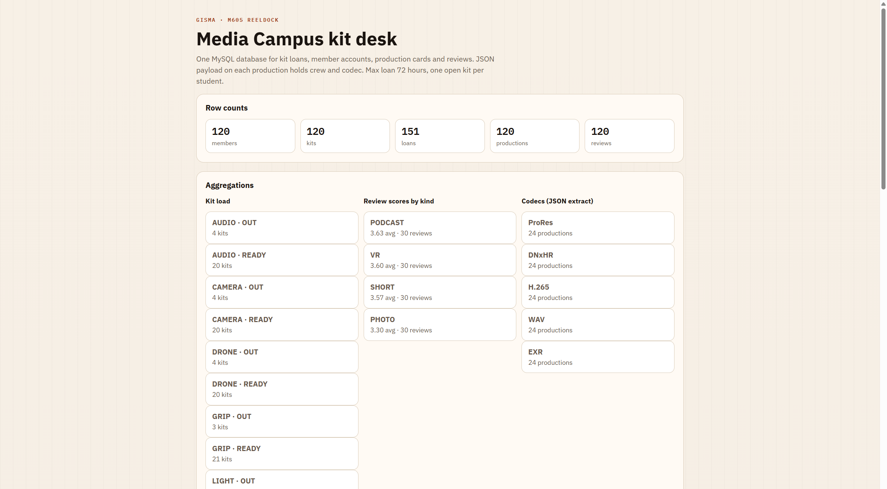
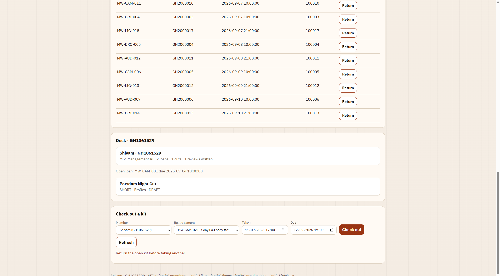
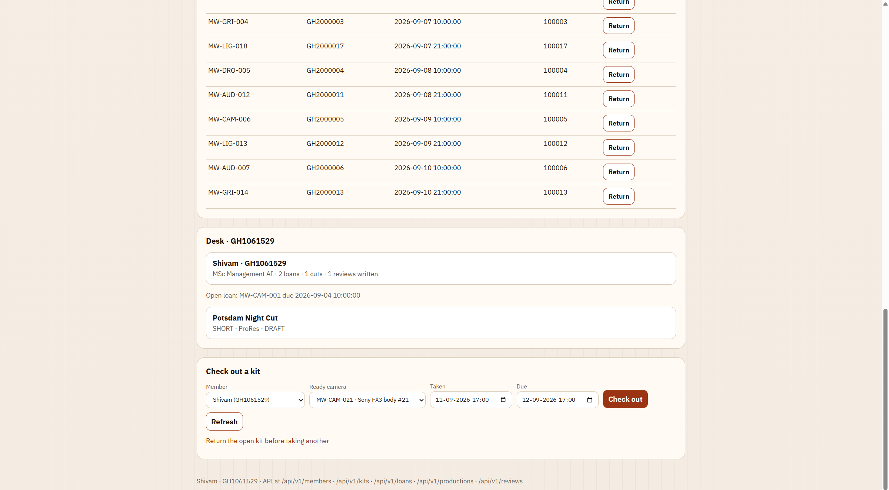

# ReelDock

Media Campus kit desk: MySQL + Spring Boot.

## Schema



## Run in VS Code

1. Install **Docker Desktop** and start it.
2. Install **JDK 21** (or newer).
3. In VS Code, install **Extension Pack for Java** (`vscjava.vscode-java-pack`).
4. File → Open Folder → select this `reeldock` folder (the one with `pom.xml`).
5. Open the Terminal in VS Code (`Ctrl+`` `) and start the database:

```powershell
docker compose up -d
```

Wait until Docker shows `reeldock-mysql` as running (about 20 seconds).

6. Open `src/main/java/com/shivampoonia/reeldock/ReelDockApplication.java`.
7. Press **F5**, or click **Run** above `main`.
8. Open **http://localhost:8089/**

MySQL is on port **3308**. The app is on port **8089**.

## Photos







Stop later with:

```powershell
docker compose down
```
